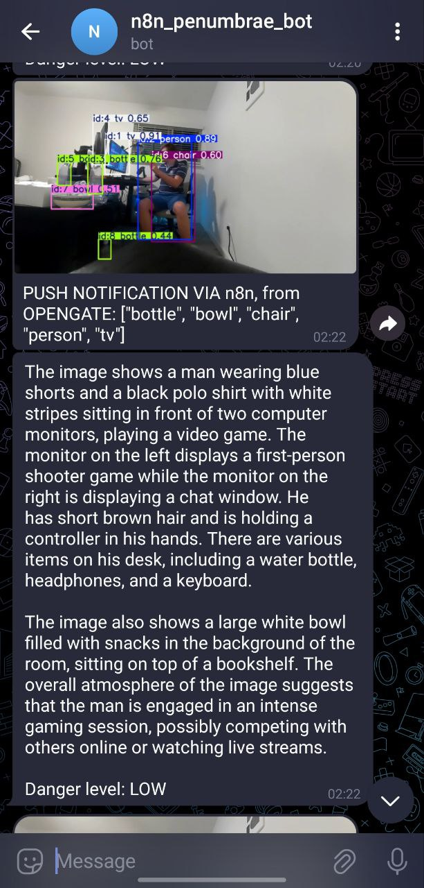

# OpenGate-RB3

## SETUP

1. Setup your Qualcomm RB3 vision board according to the [setup guide](https://docs.qualcomm.com/bundle/publicresource/topics/80-70017-253/getting_started.html)
2. Update the board to the latest version of Qualcomm Linux (tested for 1.4), according to [update guide](https://docs.qualcomm.com/bundle/publicresource/topics/80-70018-253/upgrade-rb3gen2-software.html)
3. Get the INSTALL script onto the board
   `wget https://raw.githubusercontent.com/OpenGate-RB3/OpenGate-RB3/refs/heads/main/INSTALL.bash`

4. Run the INSTALL script
   `./INSTALL.bash`

INSTALL script downloads and unpacks correct version of mediamtx multiplexer onto the board, as well as required scripts from this repository. Then puts files in correct paths, finds out your device IP, and updates the config files automatically.

If at some point you need to figure out active RB3 ip addr, use `hostname -i | awk '{print $1}'`

## STREAMING VIDEO AND AUDIO FROM THE BOARD

To start all the streams, download the RUN.bash script onto the board with `wget https://raw.githubusercontent.com/OpenGate-RB3/OpenGate-RB3/refs/heads/main/RUN.bash` and run it with `./RUN.bash`

If you want to start an individual stream, here are commands you can use:

1. 30 FPS Camera Stream: `gst-launch-1.0 -e \
qtiqmmfsrc name=qmmf ! video/x-raw,format=NV12,width=1920,height=1080,framerate=30/1 ! \
v4l2h264enc ! mpegtsmux ! udpsink host=${IPHOSTNAME} port=5004`
2. 5 FPS Camera Stream (for AI): `gst-launch-1.0 -e \
qtiqmmfsrc name=qmmf ! video/x-raw,format=NV12,width=1920,height=1080,framerate=5/1 ! v4l2h264enc ! mpegtsmux ! udpsink host=${IPHOSTNAME} port=5006`
3. Audio stream: `gst-launch-1.0 -v pulsesrc volume=2.0 ! audioconvert ! audioresample ! lamemp3enc bitrate=128 cbr=true ! mpegaudioparse ! mpegtsmux ! udpsink host=$<RB3 IP> port=5005`

If you run streams individually with those commands, only one will work at a time. Use the RUN script normally.

To see the 30FPS stream, use the link `http://<RB3 IP>:8888/videostream/`

To get the 5FPS stream, use `http://<RB3 IP>:8888/imagestream/`

To listen to audio stream on another device, `ffplay rtsp://<RB3 IP>:8554/audiostream` (also displays a spectrogram)

## STREAMING AUDIO TO BOARD SPEAKERS

To send an audio file to the board, you can use ffmpeg (replace RB3 IP addr):
`ffmpeg -re -i input.mp3 -acodec libmp3lame -ab 128k -ac 2 -f mpegts -pkt_size 188 udp://<RB3 IP>:9000`

To send an audio stream from any source on your host device to the board, use a slightly altered command:

```bash
ffmpeg -f pulse -i <AUDIO SOURCE ON HOST> \
  -acodec libmp3lame -b:a 128k -ac 2 \
  -f mpegts -mpegts_flags +system_b \
  -pkt_size 188 \
  udp://<RB3 IP>:9000
```

You can find audio sources on host with `pactl list short sources`, should look something like `alsa_output.usb-Blue_Microphones_Yeti_X_2229SG000DA8_888-000313110306-00.analog-stereo.monitor`

With correct setup, it should play audio live without delay, in good quality.

## GPIO (RING BUTTON PUSH NOTIFICATION)

- Connect a button to ground (pin 1 or 2), and GPIO pin (23 in default case)
- scp Dockerfile and monitor_button.py from ./gpio/ into any directory on RB3
- Run the gpio button monitoring

```bash
docker build -t rb3-gpio-monitor .

docker run --rm -it \
 --device=/dev/gpiochip0 \
 --device=/dev/gpiochip1 \
 --device=/dev/gpiochip2 \
 --device=/dev/gpiochip3 \
 --device=/dev/gpiochip4 \
 --device=/dev/gpiochip5 \
 -e GPIO_CHIP_DEVICE="/dev/gpiochip4" \
 -e GPIO_LINE_OFFSET="36" \
 rb3-gpio-monitor
```

Notifications will come to ntfy.sh by default.

## YOLO OBJECT DETECTION

1. Clone the repo,
2. cd into AI-recognition,
3. install dependencies with `pip install -r requirements.txt`,
4. download YOLO pt file from YOLO website of appropriate model size,
5. run `python yolo7-face.py`

To run YOLO on RB3,

- Copy contents of ./AI-recognition/RB3-docker/ to the board
- Run the Docker

```bash
docker build -t yolo-object-detector .
docker run --rm yolo-object-detector

```

## FACE RECOGNITION

To add face recognition, add pictures of faces of people you want to be recognized into `AI-recognition/known_faces` directory. Each file should be named with how you want the person object to be named when recognized. png and jpeg are valid formats for the pictures.

## N8N AUTOMATIONS

1. Install n8n automations

```bash
git clone https://github.com/n8n-io/self-hosted-ai-starter-kit.git
cd self-hosted-ai-starter-kit
```

2. Get our custom docker-compose that combines n8n with ollama and open-webui

```bash
wget https://raw.githubusercontent.com/OpenGate-RB3/OpenGate-RB3/refs/heads/main/n8n/docker-compose-v2.yml
docker-compose -f docker-compose-v2.yml --profile gpu-nvidia up -d --remove-orphans
```

3. You can find your n8n automations at localhost:5678, open-webui on localhost:3000, ollama api on localhost:11454 (ollama:11454 inside n8n)

4. Add automations to n8n. Example automation in `n8n/telegram+LLM.json`, you can upload it to n8n and edit the nodes to better suit your needs.

n8n allows you to do custom actions on messages or webhooks, and lots of other triggers, like send you back a picture from the camera, or make it explain what it sees on the image.



## PUSH NOTIFICATIONS

Easiest thing to use for push notifications is ntfy.sh.

Install the app on your phone from app store (works both on android and iphone), add a new notification source, and adjust the bucket it sends notifications to in the recognition program config.
